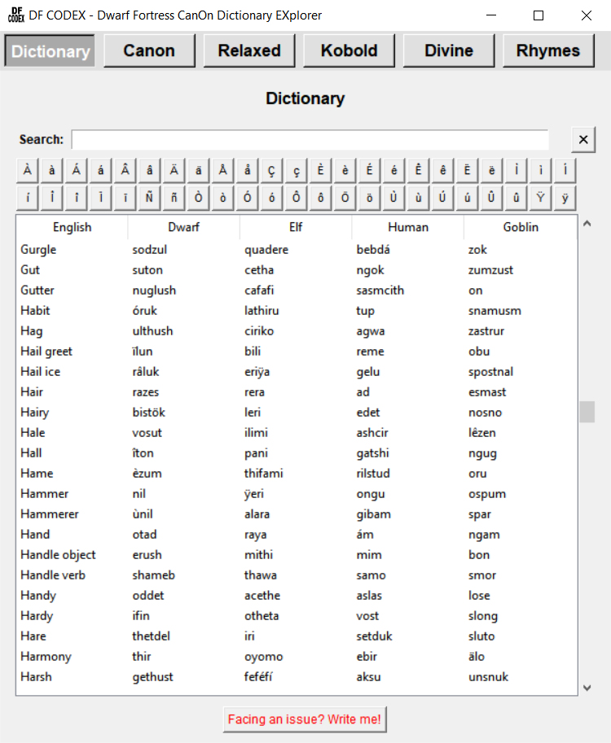
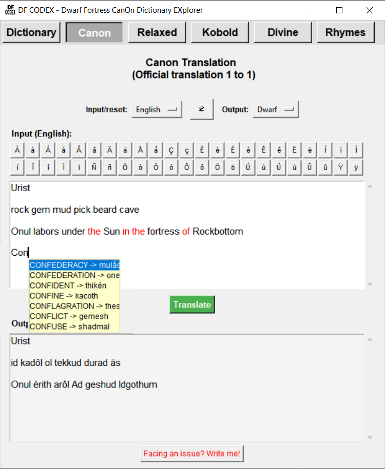
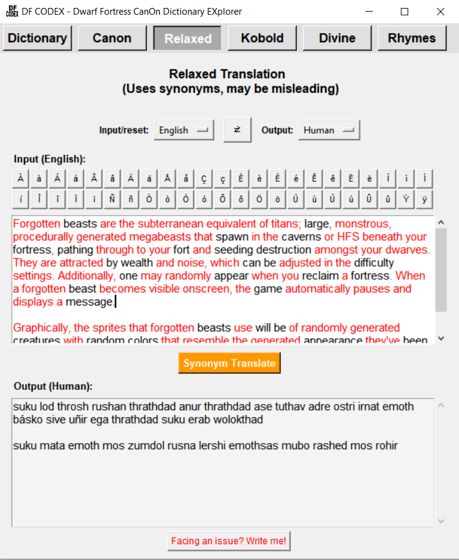
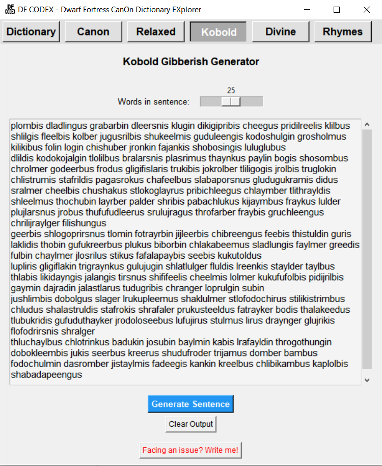
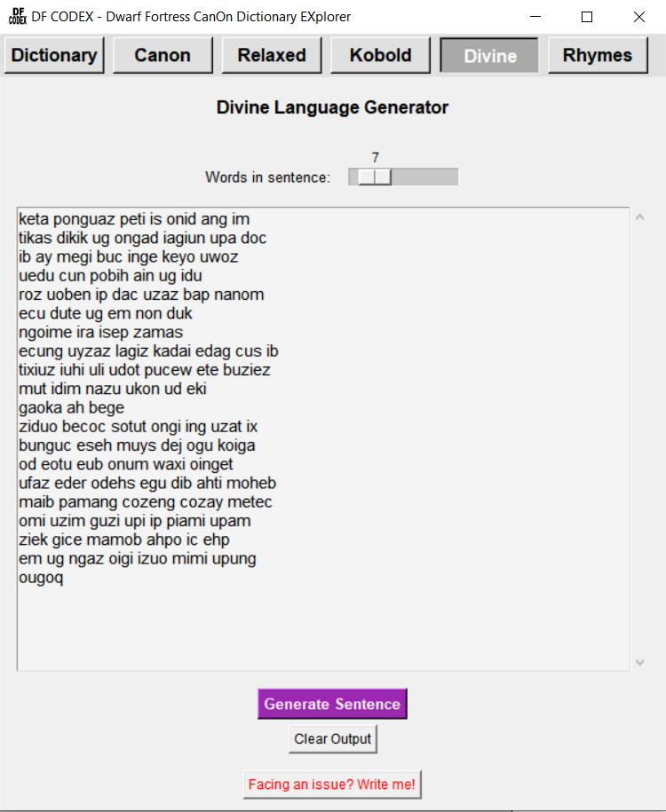
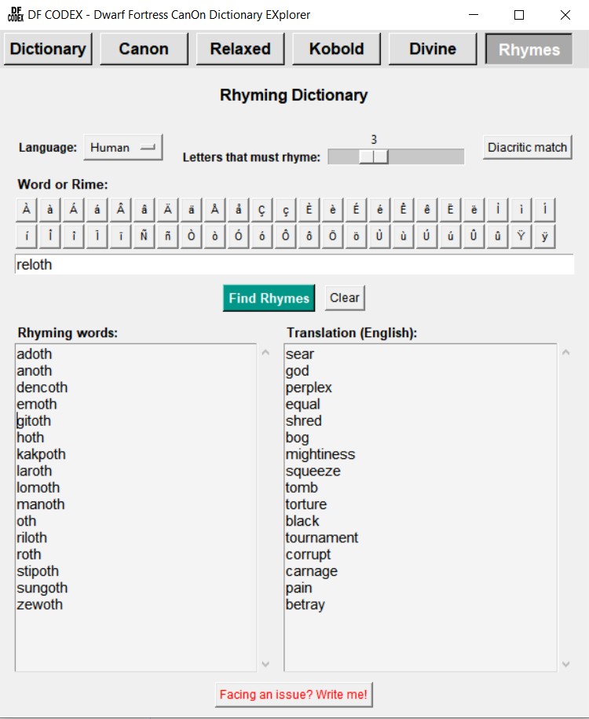

# DF CODEX (Dwarf Fortress CanOn Dictionary EXplorer)

A small dictionary-based translation tool for **Dwarf Fortress** languages.

Ever wanted your **songs**, **artifacts**, or **legendary historical figures** to actually sound like they came from the race they belong to? **DF CODEX** allows you to translate text between English and the languages of Dwarf Fortress or even between the fantasy languages themselves.

 
 
 

## Features

* Complete dictionary of the 4 official Dwarf Fortress languages:
  * Dwarven
  * Elven
  * Goblin
  * Human

* Translate between **English** and Dwarf Fortress languages.

* Translate between Dwarf Fortress languages directly.

* Use the **original in-game dictionaries**, preserving Dwarf Fortress' own limitations and style.

* Red words in the input are words not present in the dictionary and thus not translated.

* Correctly handles compound words used in:
  * Surnames
  * Site names
  * Other generated names

* Supports:
  * English verb conjugations
  * Plural forms
  * Synonyms
  * Autocomplete for special characters and uncommon words

* Find words in the **Dictionary** section

* Translate with two modes: **Canon** and **Relaxed**
  * **Canon** translates the words as they are found, including their conjugations and plurals. It is stricter and finds fewer words. Some words may be directly translated without the correct paraphrases  (e.g. "will" translated as "will" as "the will of the king" and not as "the king will be in the fortress", or "just" translated as "just" as "a just king" and not as "just in time")
  * **Relaxed** translates using a synonym dictionary and allows switching between English and American English. It finds more words, but some translations may be misleading (e.g., "Baron" translated as "King" because DF dictionary has only "King" and the English dictionary has Baron as synonym).

* Kobold and Divine language generator:
  * Generates procedurally constructed Kobold and Divine language sentences.
  * Based on the official DF structured construction rules.
  * Adjustable sentence length.

* Look for rhymes of different length in the Rhyme Dictionary.

## About the Translation System

DF Translator intentionally uses the same limited vocabulary available in Dwarf Fortress. This means:

* Not every English word has a translation.
* Punctuation is not supported.
* Missing words are highlighted and removed from the output.

This limitation is part of the charm: creating meaningful text, songs, and poems becomes a creative challenge using the available vocabulary.

## Usage

The application is designed to be simple:

1. Enter your text.
2. Select the source and target languages.
3. Translate.

No configuration or complicated setup is required.

The special character shortcuts allow you to quickly write words that start with uncommon characters without having to copy them manually. Press the desired character and then press **Tab** to display available words.

You can also switch to the **Kobold** or **Divine** tabs to generate random procedurally constructed sentences.

## Examples

### Song / Poem Translation

English:

```text
Champions are rewarded by Fortune!
```

Dwarven translation:

```text
akur akir akam
```

### Site Translation

English:

```text
Poisoncrazy
```

Goblin translation:

```text
Stozukagus
```

### Complex Name Translation

English:

```text
Zimesh Shadowfated the Tenebrous Crypts-Oblivion of Dusks
```

Human translation:
```text
Zimesh Osmanomep Geso Gogol Zitha Disem
```

## Platform Support

* **Windows:** Download `DF_CODEX_Windows.exe` from the releases page and double-click it.
* **MacOS:** Download `DF_CODEX_MacOS.zip` from the releases page, unzip it to get the `df_codex.app` bundle, and move it to your Applications folder. (Note: Because the app is unsigned, you may need to right-click the app and select **Open** the first time you run it).
* **Linux:** Download the `DF_CODEX_Linux` binary (built via GitHub Actions). Make sure to give it execution permissions before running:

```bash
chmod +x DF_CODEX_Linux
./DF_CODEX_Linux
```

## Feedback and Bug Reports

DF Translator is actively tested, but bugs may still exist.

If you find an issue, have a suggestion, or want to provide constructive feedback, please open an issue in this repository.

## Open new branches

Contact me to start working on your own branch of this tool

## Final Remark

Enjoy creating songs, poems, names, and stories in the languages of Dwarf Fortress!

## License
This project is licensed under the MIT License - see the LICENSE file for details.

## Third-Party Components & Data Notice:
* Dwarf Fortress Language Data Files (language_*.txt): Created by Tarn and Zach Adams (Bay 12 Games). Used for translation and vocabulary mapping. All official rights to Dwarf Fortress content belong to Bay 12 Games.
* WordNet Dataset (synonyms.txt.gz): Derived from WordNet Release 3.0, Copyright 2006 by Princeton University. Used under Princeton's open dataset terms (provided "AS IS" without fee or royalty).
